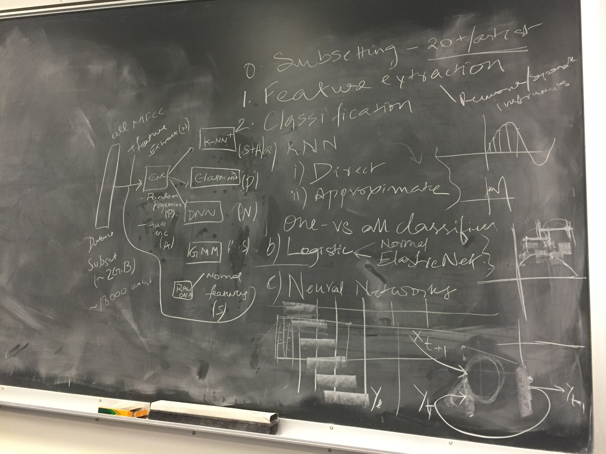

# Project Apollo
## Advanced Machine Learning

This is a machine learning project built to detect artists based on audio features only. It's very different from applications like Shazam where song signature is matched across a given database.

Instead we process the [MFCC features](https://en.wikipedia.org/wiki/Mel-frequency_cepstrum) of a given song to generate a model which can detect an artist, even if the song is previously unheard of. We evaluated various models and their accuracies on the [Million Song Database](http://labrosa.ee.columbia.edu/millionsong/). This whole setup by done using Amazon Web Services.

## The Plan (for reference :D)  



### To install prerequisites use
```` pip install -r requirements.txt````
